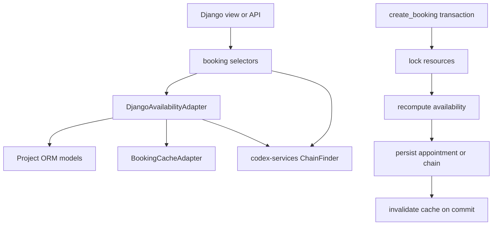

<!-- DOC_TYPE: CONCEPT -->

# Booking Module

## Purpose

`codex_django.booking` is the Django adapter layer for the resource-slot booking engine that lives in `codex-services`.
Its job is not to reimplement scheduling logic.
Its job is to bridge Django project models and transaction semantics to the engine's provider-oriented interface.

This module gives a Django project three things at once:

- reusable abstract models for booking-related entities
- ORM-based adapters that convert project data into engine input
- selector functions that expose booking operations in a view-friendly form

So `booking` is best understood as an integration layer between Django domain data and resource-slot scheduling intelligence in `codex-services`.

## Architectural Boundary

The core booking algorithm is delegated to `ChainFinder` and related DTOs from `codex-services`.
`codex_django.booking` focuses on the Django-specific concerns around that engine:

- how resources/executors, services, schedules, and appointments are modeled
- how ORM data is converted into `BookingEngineRequest` and `MasterAvailability`
- how row locking and transaction boundaries are handled during booking creation
- how busy-slot caching is invalidated safely

This separation is important because it keeps scheduling rules reusable across frameworks while still giving Django projects a practical integration path.

## Main Building Blocks

### Composable Booking Models

The `mixins` package defines abstract model mixins for the core booking entities:

- `AbstractBookableMaster`
- `AbstractBookableService`
- `AbstractBookableAppointment`
- `AbstractWorkingDay`
- `MasterDayOffMixin`
- `AbstractBookingSettings`

These are not final project models.
They are scaffolding primitives that let each project keep its own foreign keys, categories, statuses, and business details while still matching the expectations of the adapter layer.

The design choice here is composability over hardcoded schema.

### Availability Adapter

`DjangoAvailabilityAdapter` is the center of the module.
It translates Django ORM state into the provider data structures expected by the booking engine.

It is responsible for:

- building engine requests from service ids and resource selections
- resolving which resources can perform which services
- collecting working hours, breaks, days off, and busy intervals
- constructing availability DTOs consumed by the engine (`MasterAvailability` class name in current `codex-services`)
- locking resource rows during booking creation

In effect, this adapter is the contract translator between Django models and `ChainFinder`.

### High-Level Selectors

`booking.selectors` contains pure-function entry points used by views and generated feature code:

- `get_available_slots()`
- `get_nearest_slots()`
- `get_calendar_data()`
- `create_booking()`

These functions keep orchestration outside of model methods.
That makes them easier to reuse from views, APIs, commands, and future generated code.

### Cache Adapter

`BookingCacheAdapter` is a thin bridge over the Redis booking cache manager from `core`.
The module's caching strategy is intentionally narrow:

- cache busy intervals per resource per date
- compute free windows dynamically from those intervals
- invalidate only the affected resource/date entries after a successful booking change

This keeps cache invalidation surgical and avoids storing derived slot maps as the primary source of truth.

### Booking Settings Sync

`AbstractBookingSettings` provides configurable booking defaults such as:

- slot step size
- default buffer between appointments
- advance booking limits
- fallback working hours for all 7 weekdays

The booking adapter reads fallback hours only from booking settings.
It does not depend on site settings.
Timezone handling defaults to `UTC` unless a project passes a different
runtime timezone into the adapter or exposes a per-resource timezone field.

Its save hook synchronizes settings to Redis, following the same general pattern used elsewhere in the repository for runtime-accessed administrative state.

## Concurrency Model

The most important architectural concern in this module is not slot computation itself, but safe booking creation under concurrency.

`create_booking()` follows a defensive flow:

1. enter a transaction
2. lock the relevant resource rows
3. recompute availability under lock
4. verify the requested start time still exists
5. persist the appointment or the multi-service chain
6. invalidate cache only after transaction commit

This design avoids the classic problem where a slot appears free during initial display but is taken before final confirmation.

For multi-service booking, the module introduces a `BookingPersistenceHook` protocol.
That keeps the persistence of complex booking chains project-specific while preserving the shared locking and revalidation logic.

## Naming And Compatibility Policy

Starting from `0.3.0`, the public booking API uses neutral naming:

- `resource_id` instead of `master_id`
- `resource_selections` instead of `master_selections`
- `lock_resources()` instead of `lock_masters()`

This change is intentionally immediate-break for runtime surfaces in `codex_django.booking`.
Some model mixin names remain historical (`AbstractBookableMaster`, `MasterDayOffMixin`) for schema compatibility in existing projects.

## Runtime Flow

## Role In The Repository

`booking` is the domain adapter layer for appointment scheduling.
It is where the repository turns generic booking engine capabilities into Django-usable building blocks.

That makes it different from:

- `core`, which provides shared infrastructure primitives
- `system`, which provides project-state models and admin workflows
- `notifications`, which handles message dispatch around domain events

`booking` sits closer to business behavior than those modules, but it still remains an adapter library rather than a full concrete booking application.

## See Also

- `notifications` for confirmation and reminder workflows built on top of booking events
- `system` for site-facing project state that remains outside booking runtime math
- `codex-services` for the actual slot-finding and chain-solving engine this module integrates with
