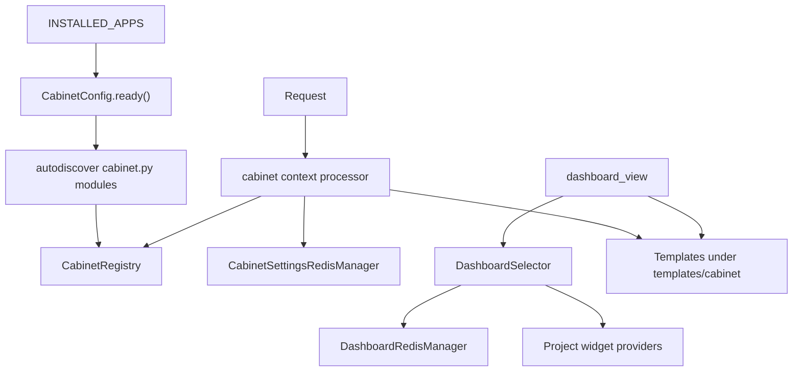

<!-- DOC_TYPE: CONCEPT -->

# Cabinet Module

## Purpose

`codex_django.cabinet` is the library's internal dashboard application.
Unlike the public-facing parts of a generated project, cabinet is developed inside the library as a reusable, isolated app with its own templates, static assets, registry, and runtime conventions.

Its purpose is not only to render pages.
It provides a structured way for project modules to contribute:

- navigation sections
- dashboard widgets
- topbar actions
- cabinet-specific settings

So the module acts as both a UI shell and an extension framework for administrative and personal dashboard experiences.

## Architectural Position

Cabinet sits differently from the other top-level packages:

- `core`, `system`, `booking`, and `notifications` mostly provide reusable backend primitives
- `cabinet` provides a reusable application surface with UI composition rules

It is still part of the library, but it behaves more like a packaged mini-application than like a simple utility module.

This is why its architecture revolves around registration, templating, namespacing, and cacheable view data rather than around one set of model mixins or selectors alone.

## Main Design Principles

### Fully Isolated App

The cabinet app is intentionally isolated:

- its own templates under `templates/cabinet/`
- its own static assets under `static/cabinet/`
- its own app config and urls
- its own context processor
- its own Redis-backed settings cache

This makes it possible to reuse cabinet across generated projects without mixing it with the project's public-site structure.

### Two-Space Model

Cabinet hosts two independent spaces under a single app:

| Space | URL prefix | Base template | Audience |
|-------|-----------|---------------|---------|
| `staff` | `/cabinet/` | `base_cabinet.html` | Owners and administrators |
| `client` | `/cabinet/my/` | `base_client.html` | End-customers |

Each space has its own topbar, sidebar, and shortcuts registered separately via `declare(space=...)`.
CSS token sets are also independent: staff uses `:root { --cab-* }`, client uses `.cab-wrapper--client { --cab-* }`.
Projects can override both palettes independently.

### Registry-Based Extension

The key extension mechanism is the in-memory `CabinetRegistry`.
Feature apps expose cabinet contributions through `cabinet.py`, and `CabinetConfig.ready()` loads those modules via `autodiscover_modules("cabinet")`.

The public API is `declare(...)`, which accepts:

- `space` — `"staff"` or `"client"` (v2 API)
- `topbar` — a `TopbarEntry` for the staff topbar dropdown
- `sidebar` — a list of `SidebarItem` for the module's sub-navigation
- `shortcuts` — quick-action links in the topbar
- `dashboard_widget` — a `DashboardWidget` declaration

Legacy v1 (`section=CabinetSection(...)`) is still supported for backward compatibility.

This design keeps feature modules explicit.
Projects do not need fragile introspection or convention-only discovery to contribute to the dashboard.

### Immutable Contracts — Types Package

All registration and data contracts are defined as frozen dataclasses organized in the `cabinet/types/` package:

| Module | Types |
|--------|-------|
| `types/nav.py` | `TopbarEntry`, `SidebarItem`, `Shortcut` |
| `types/widgets.py` | `MetricWidgetData`, `TableWidgetData`, `ListWidgetData`, `TableColumn`, `ListItem` |
| `types/components.py` | `DataTableData`, `CalendarGridData`, `CardGridData`, `ListViewData`, `SplitPanelData` + supporting types |
| `types/registry.py` | `DashboardWidget`, `NavAction`, `CabinetSection` (deprecated) |

Navigation and registry types are `frozen=True` — instances are immutable after creation.
Because the registry is global process memory, immutable declarations prevent accidental mutation from views or middleware.

### Group-Based Navigation

Cabinet supports several navigation groups, currently including:

- `admin`
- `services`
- `client`

The context processor filters sections and widgets by:

- current navigation group
- current user permissions

This lets one cabinet app host multiple dashboard perspectives without duplicating the entire framework for each audience.

## Main Building Blocks

### Context Processor

`cabinet.context_processors.cabinet()` is the bridge between the registry and templates.
It injects:

- filtered navigation
- topbar actions
- dashboard widgets
- cached cabinet settings

Its behavior is defensive by design: even anonymous users receive the expected keys with empty values so templates do not crash.

### Dashboard Selector

`cabinet.selector.dashboard.DashboardSelector` is the data aggregation entry point for the dashboard.
It allows providers to be registered with:

- a cache key
- a cache TTL
- either a flat provider function or a typed adapter

The module includes adapter shapes for common widget data patterns such as metrics, tables, and lists.

This gives cabinet an extensible data layer without forcing all widget providers into one monolithic view.

### Redis-Backed Cabinet State

Cabinet uses dedicated Redis managers for two kinds of state:

- cabinet settings
- per-provider dashboard cache

`CabinetSettings` is modeled as a singleton and synchronized into Redis on save.
Dashboard provider results are cached separately per provider key, which allows surgical invalidation when one widget's data changes.

### Content Components

Cabinet ships five reusable template components in `cabinet/templates/cabinet/components/`:

| Template | Contract type | Interaction |
|----------|--------------|-------------|
| `data_table.html` | `DataTableData` | Alpine search/filters, HTMX row actions |
| `calendar_grid.html` | `CalendarGridData` | CSS Grid layout, HTMX slot/event click |
| `card_grid.html` | `CardGridData` | Alpine grid/list toggle |
| `list_view.html` | `ListViewData` | Alpine search, HTMX row click |
| `split_panel.html` | `SplitPanelData` | HTMX detail panel loading |

Each component receives a single typed contract object when the page template renders the component include with `obj=obj`.
The backend computes all values; templates contain no business logic.

**Modal dispatch pattern:** components do not embed modals.
Instead they dispatch `$dispatch('open-modal', {url: '...'})`.
The page-level `cabinet/includes/_modal_base.html` include listens and loads content via HTMX.

**CSS:** standard Bootstrap 5 is used where possible.
Custom CSS in `cab_components.css` covers calendar grid (CSS Grid layout) and split panel (two-column grid).

### Views And Template Shell

The current built-in views are thin:

- dashboard index
- site settings page
- HTMX tab partials for settings

That thinness is deliberate.
The cabinet layer is designed so that:

- the registry defines structure
- selectors provide data
- templates compose the UI from reusable components
- projects can override or extend pages through normal Django mechanisms

## Runtime Flow

## Role In The Repository

`cabinet` is the packaged dashboard surface of `codex-django`.
It provides the reusable structure needed to assemble:

- admin navigation
- service-oriented dashboards
- client-facing cabinet views

without forcing every project to reinvent the entire shell.

This makes it one of the most application-like modules in the repository.
It is still a library component, but one that provides a full compositional UI framework rather than only backend helpers.

## Relationship To Other Modules

- `system` can provide settings and content that cabinet surfaces or edits
- `booking` can register cabinet sections and dashboard widgets for scheduling workflows
- `notifications` can contribute metrics or settings-related actions
- `core` provides the Redis base layer that cabinet-specific managers build on

## See Also

- `system` for project-state models that often back cabinet pages
- `booking` for feature modules that may plug into the cabinet registry
