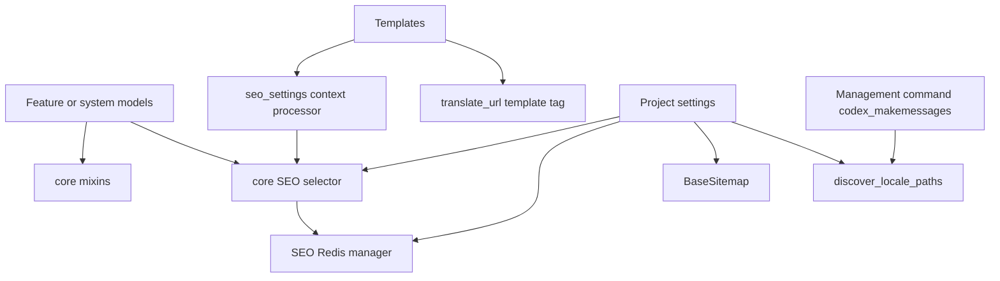

<!-- DOC_TYPE: CONCEPT -->

# Core Module

## Purpose

`codex_django.core` is the shared infrastructure layer used by Django projects generated with or built on top of `codex-django`.
It does not represent one business domain. Instead, it collects cross-cutting building blocks that many features need at the same time:

- reusable model mixins
- SEO access for templates
- i18n discovery and URL helpers
- sitemap base behavior
- Redis-backed infrastructure caches
- small framework-level helpers for templates and management commands

This makes `core` the place where a project gets common Django primitives before feature modules add product-specific behavior.

## What Lives Here

### Model Mixins

`core.mixins.models` provides abstract Django model mixins such as:

- `TimestampMixin`
- `ActiveMixin`
- `SeoMixin`
- `OrderableMixin`
- `SoftDeleteMixin`
- `UUIDMixin`
- `SlugMixin`

These mixins standardize recurring field patterns across projects so generated apps can stay consistent without reimplementing basic model concerns.

### SEO Integration

The SEO path is built around two pieces:

- `core.seo.selectors.get_static_page_seo()`
- `core.context_processors.seo_settings()`

The selector reads SEO data from a model defined in `CODEX_STATIC_PAGE_SEO_MODEL`, caches it through the SEO Redis manager, and returns a flat dictionary suitable for templates.
The context processor resolves the current route name and exposes the result as `seo` in template context.

In practice, `core` does not own SEO content itself. It provides the access path and cache strategy that feature or system models plug into.

### Redis Infrastructure

`core.redis.managers` contains the base Redis adapter and several specialized managers:

- `BaseDjangoRedisManager` builds project-prefixed keys and reads `REDIS_URL`
- `SeoRedisManager` caches static page SEO payloads
- `DjangoSiteSettingsManager` caches site settings and exposes a template-friendly proxy
- `BookingCacheManager` caches busy booking intervals per master and date
- `NotificationsCacheManager` caches notification-related values

The pattern is consistent across the module: async-first manager methods with synchronous wrappers for regular Django usage.
This lets higher-level modules use Redis without repeating connection setup and key conventions.

`core.redis.django_adapter` is a lighter utility that the session and cache backends use instead of inheriting `BaseDjangoRedisManager`. It exposes `build_redis_client`, `build_redis_service`, and `namespaced_key` without carrying the `_is_disabled` local-dev bypass — ensuring that session and cache backends always behave consistently.

For the full Django session and cache backends, see [Redis Cache and Session](redis.md).

### Internationalization Helpers

`core.i18n.discovery.discover_locale_paths()` discovers locale directories in several project layouts:

- centralized `locale/<domain>/...`
- top-level app-local `locale/`
- feature-local `features/<name>/locale/`

`core.templatetags.codex_i18n.translate_url` complements this by giving templates a simple language-switching helper based on the current request path.

Together, these pieces support the modular translation strategy used by Codex projects.

### Sitemap Base

`core.sitemaps.BaseSitemap` is a reusable sitemap base class with opinions already applied:

- i18n enabled by default
- canonical domain forced from settings
- HTTPS forced for generated URLs
- alternate language links and `x-default` support
- fallback namespace lookup for route names

This removes repeated sitemap boilerplate from downstream apps.

### Management Support

`core.management.commands.codex_makemessages` adds a modular translation workflow on top of Django's `makemessages`.
Instead of treating the whole project as one translation surface, it discovers domains from templates, apps, and feature folders, then runs extraction domain by domain.

This matches the architecture where translations are organized by project subdomain rather than one global message catalog.

## Internal Architecture

## Design Role In The Repository

`core` is the foundation layer for framework-level reuse.
If another package describes a business capability such as booking or notifications, `core` describes the shared mechanics that make those capabilities easier to integrate into a Django project.

That is why `core` mixes multiple concerns that would otherwise feel unrelated:
they are all project-wide concerns rather than feature-specific ones.

## See Also

- `system` for project state, settings, fixtures, and broader infrastructure mixins
- `booking` for booking-specific model mixins and adapters built on top of shared infrastructure
- `notifications` for delivery-specific notification orchestration
