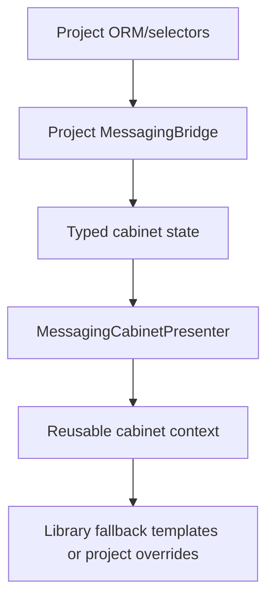
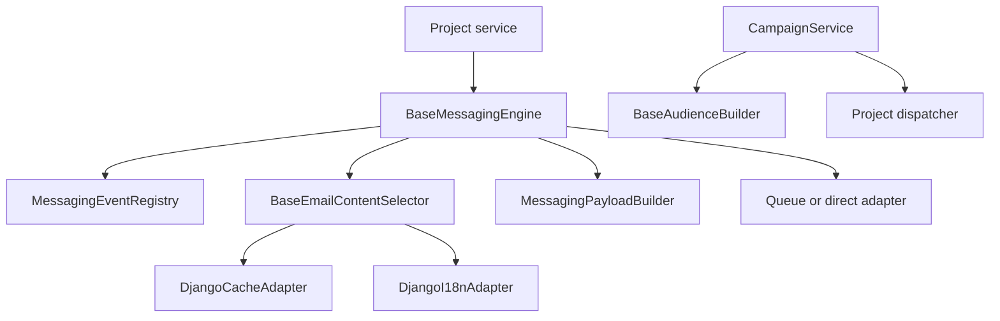

<!-- DOC_TYPE: CONCEPT -->

# Messaging Module

## Purpose

`codex_django.messaging` is the Django-facing messaging orchestration layer for Codex projects. It supersedes `codex_django.notifications` and expands the reusable surface beyond dispatch alone.

It combines:

- localized content selection
- payload construction
- queue/direct delivery adapters
- abstract Django models for messaging data
- campaign audience batching primitives
- cabinet contracts, bridge protocol, presenters, workflows, navigation helpers,
  and reusable fallback templates

## Module Shape

The package is intentionally split into small roles:

- `service`: orchestration entrypoint via `BaseMessagingEngine`
- `builder`: serializable payload construction
- `selector`: localized content lookup with caching
- `registry`: event registration plus `email_template` / `email_rendered`
- `adapters`: Django runtime bridges
- `mixins.models`: abstract reusable ORM models
- `cabinet`: cabinet state contracts, bridge protocol, presenters, workflows,
  navigation helpers, and reusable fallback templates
- `audience` / `campaigns`: reusable campaign batching primitives

## Compatibility Story

`notifications` remains as a deprecating facade for one minor release:

- old import paths still resolve
- package-level access emits `DeprecationWarning`
- old and new registry surfaces share the same global registry object

This keeps downstream projects working while moving the canonical API to `messaging`.

## What The Library Owns

The library owns the reusable contracts and orchestration pieces:

- engine, selectors, builders, adapters
- abstract models and Redis sync helpers
- cabinet DTOs and bridge protocols
- audience streaming and campaign batching services

The library does not own:

- project concrete models
- admin registration
- URLs or views
- project-specific HTML templates for inbox/campaign UIs
- worker callback endpoints

The library ships reusable `cabinet/messaging/...` partials and fallback pages.
Projects still own URLs, views, bridge implementations, and template overrides.

## Cabinet Flow

## Runtime Flow

