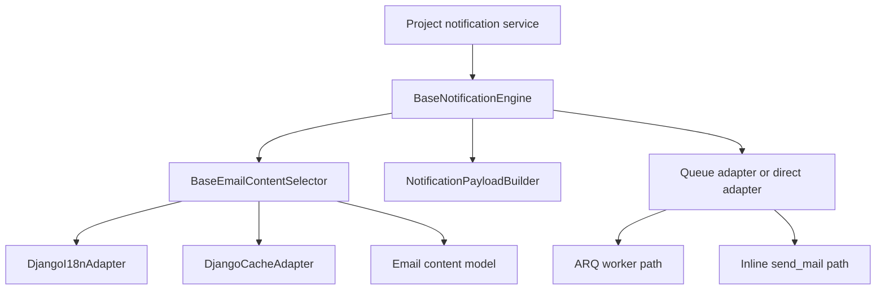

<!-- DOC_TYPE: CONCEPT -->

# Notifications Module

## Purpose

`codex_django.notifications` is the Django-facing notification orchestration layer of the repository.
It does not implement the low-level delivery engine itself. Instead, it adapts Codex notification concepts to common Django runtime patterns:

- ORM-backed content lookup
- Django i18n language switching
- Redis-backed caching
- transaction-aware queue dispatch
- optional direct inline delivery for simple or local environments

This lets projects build their own notification services without rewriting the same integration glue for every app.

## Core Idea

The module is intentionally split into small collaborating roles:

- a content model for editable notification text
- a selector that reads and caches localized content
- a payload builder that creates worker-safe dictionaries
- an engine that orchestrates subject resolution and dispatch
- adapters that decide how delivery is triggered

Selectors can also define a `cache_key_prefix`, which lets projects isolate notification content caches by domain or feature without forking the selector logic.

So the module is not "email sending code in one place".
It is a composable notification pipeline.

## Main Building Blocks

### Editable Content Model

`BaseEmailContentMixin` defines the model shape for notification content blocks stored in the database.
Entries are keyed, categorized, and described, which makes them suitable for admin-managed subject lines and message fragments.

This creates a separation between:

- notification logic in Python
- notification wording in data

That is important for multilingual or frequently updated projects.

### Localized Content Selection

`BaseEmailContentSelector` is responsible for resolving a content key in a given language.
Its read path is:

1. build a cache key
2. check cache
3. enter a translation override
4. query the configured model
5. cache the resolved text

This means localization and caching are treated as part of content retrieval, not as concerns spread across every notification sender.

### Payload Construction

`NotificationPayloadBuilder` creates plain dictionaries intended for queue serialization.
It supports two distinct delivery modes:

- `template`: the worker receives a template name and context, then renders later
- `rendered`: the payload already contains final HTML/text content

This is a useful boundary because it separates message orchestration from the rendering strategy.
Projects can choose whether rendering happens before enqueueing or inside the worker.

### Dispatch Engine

`BaseNotificationEngine` ties the selector, builder, and queue adapter together.
It resolves the localized subject, creates a notification id, chooses a payload mode, and delegates final delivery to the configured adapter.

Architecturally, this is the main extension point for projects.
The expected pattern is to subclass the engine and add domain-specific `send_*` methods for events such as booking confirmation or password reset.

### Delivery Adapters

The module contains several adapters with distinct responsibilities:

- `DjangoQueueAdapter` pushes jobs through an ARQ client and can defer enqueueing until transaction commit
- `DjangoDirectAdapter` sends notifications inline without a worker
- `DjangoCacheAdapter` bridges notification content lookup to the Redis cache manager
- `DjangoI18nAdapter` wraps Django language overrides
- `DjangoArqClient` is the ARQ-facing client boundary

The important design choice is that the engine does not care whether delivery is queued or direct.
That decision is pushed into adapters.

## Runtime Flow

## Architectural Role

`notifications` acts as a boundary module between project code and the lower-level Codex notification infrastructure.
It gives Django projects a reusable orchestration layer while keeping concrete delivery concerns swappable.

This makes the package useful in multiple deployment styles:

- full async delivery through queue workers
- transaction-safe enqueueing in regular Django views
- direct delivery in local or simplified environments

## Relationship To Other Modules

- `core` provides the Redis manager used by notification caching
- `system` can host integration settings and credentials that notification services may depend on
- `notifications` itself focuses on message selection, payload assembly, and delivery triggering

## See Also

- `system` for site settings and integration credentials that can feed notification workflows
- `core` for shared Redis infrastructure used by the cache adapter
