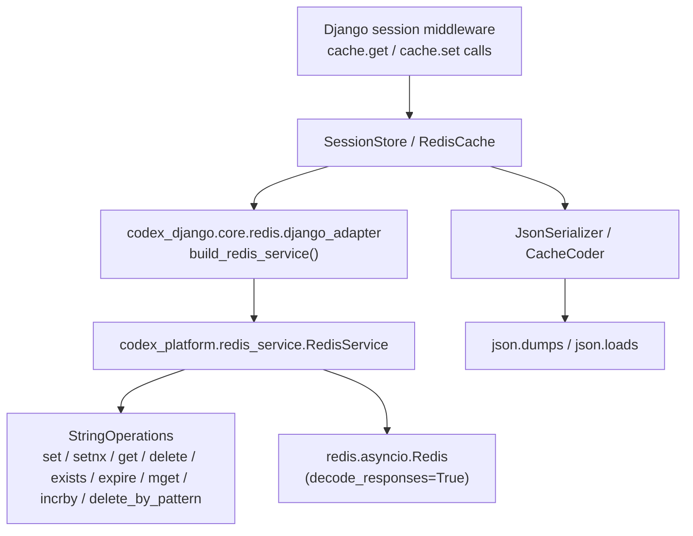

<!-- DOC_TYPE: CONCEPT -->

# Redis Cache and Session Layer

## Purpose

`codex_django.sessions` and `codex_django.cache` provide native Django
session and cache backends built entirely on the `codex-platform` async Redis
stack. They allow downstream projects to use standard Django cache and session
APIs without the `django-redis` package and without the `pickle`
serialization it enables by default.

This layer sits one level above the existing domain-specific Redis managers
(`SeoRedisManager`, `BookingCacheManager`, …) and is deliberately distinct
from them. Domain managers carry optional local-dev disable logic
(`CODEX_REDIS_ENABLED`). Cache and session backends must not be silently
disabled — a broken Redis must surface as an error, not as an empty session or
a cache miss.

## What Lives Here

### Session Backend

`codex_django.sessions.backends.redis.SessionStore` is a
`django.contrib.sessions.backends.base.SessionBase` subclass.

- Stores session payload as the Django **encoded string** —
  `SessionBase.encode()` / `SessionBase.decode()`, so the encoding format is
  controlled by `SESSION_SERIALIZER` (recommend
  `django.contrib.sessions.serializers.JSONSerializer`).
- Uses `codex_platform.redis_service.operations.string.StringOperations`:
  - `setnx(key, payload, ttl=ttl)` — atomic `SET NX EX` for `must_create`,
    raises `CreateError` if the key exists.
  - `set(key, payload, ttl=ttl)` — standard `SETEX` for updates, raises
    `UpdateError` if the key is missing.
  - `get` / `delete` / `exists` for load, delete, and existence checks.
- TTL = `self.get_expiry_age()` driven by `SESSION_COOKIE_AGE`.
- Redis key: `{PROJECT_NAME}:{CODEX_SESSION_KEY_PREFIX}:{session_key}`.
- Async-native (`aexists`, `acreate`, `aload`, `asave`, `adelete`); sync
  variants are `asgiref.sync.async_to_sync` wrappers — the established pattern
  across all codex-django Redis managers.

### Cache Backend

`codex_django.cache.backends.redis.RedisCache` is a
`django.core.cache.backends.base.BaseCache` subclass.

Implements the full practical Django cache contract:

| Method | Redis primitive |
|---|---|
| `get` | `GET` |
| `set` | `SETEX` / `SET` / `DEL` based on timeout |
| `add` | `SET NX EX` (atomic) |
| `delete` | `EXISTS` + `DEL` |
| `has_key` | `EXISTS` |
| `touch` | `EXPIRE` / `PERSIST` / `DEL` based on timeout |
| `get_many` | `MGET` |
| `set_many` | batched `SETEX` calls |
| `delete_many` | batched `DEL` |
| `incr` / `decr` | `INCRBY` |
| `clear` | `SCAN + DEL` scoped to `{KEY_PREFIX}:*` |

Timeout semantics mirror Django's contract:
`DEFAULT_TIMEOUT` → `default_timeout`, `None` → persist, `≤ 0` → delete.

### JSON Serializer

`codex_django.cache.serializers.JsonSerializer` converts values to / from
compact UTF-8 JSON strings (`json.dumps(ensure_ascii=False)`). Any value
that `json.dumps` cannot handle raises `TypeError`. There is no pickle
fallback and no silent downgrade. A pluggable replacement can be wired through
`CACHES["default"]["OPTIONS"]["SERIALIZER"]` — the class only needs to expose
`dumps(value) -> str` and `loads(raw) -> Any`.

### CacheCoder

`codex_django.cache.values.CacheCoder` provides explicit helpers for types
the JSON serializer rejects:

- Per-type: `dump_datetime / load_datetime`, `dump_date / load_date`,
  `dump_timedelta / load_timedelta`, `dump_decimal / load_decimal`,
  `dump_uuid / load_uuid`, `dump_set / load_set`, `dump_bytes / load_bytes`.
- Recursive: `CacheCoder.dump(value)` converts nested `dict` / `list` /
  `tuple` by walking known types.

Callers invoke these helpers explicitly. The cache backend itself does not
apply them automatically, which keeps Redis values interoperable with other
Redis clients and avoids a hidden breaking change if the helper behaviour
ever changes.

### Shared Adapter

`codex_django.core.redis.django_adapter` is the thin internal module that
constructs a Redis client and service for both backends:

- `build_redis_client(url=None)` — `Redis.from_url(..., decode_responses=True)`.
- `build_redis_service(url=None)` — wraps the client in `RedisService`.
- `namespaced_key(prefix, key, *, project_name=None)` — replicates
  `BaseDjangoRedisManager.make_key` logic without requiring an instance.

## Internal Architecture

## Relationship to Domain Managers

Domain Redis managers (`SeoRedisManager`, `BookingCacheManager`, etc.) inherit
from `BaseDjangoRedisManager` and carry the `_is_disabled()` shortcut.
Session and cache backends do **not** inherit from it — they use
`django_adapter` directly so that no environment flag can accidentally disable
them.

## Failure Semantics

- `RedisConnectionError` and `RedisServiceError` from `codex-platform`
  propagate untouched to the caller.
- The session backend never returns an empty session on Redis failure.
- The cache backend never silently degrades to in-memory storage.

If a project needs graceful degradation, it should add that logic at the
application layer (e.g., catch `RedisConnectionError` in the view and return a
503), not in the backend.
