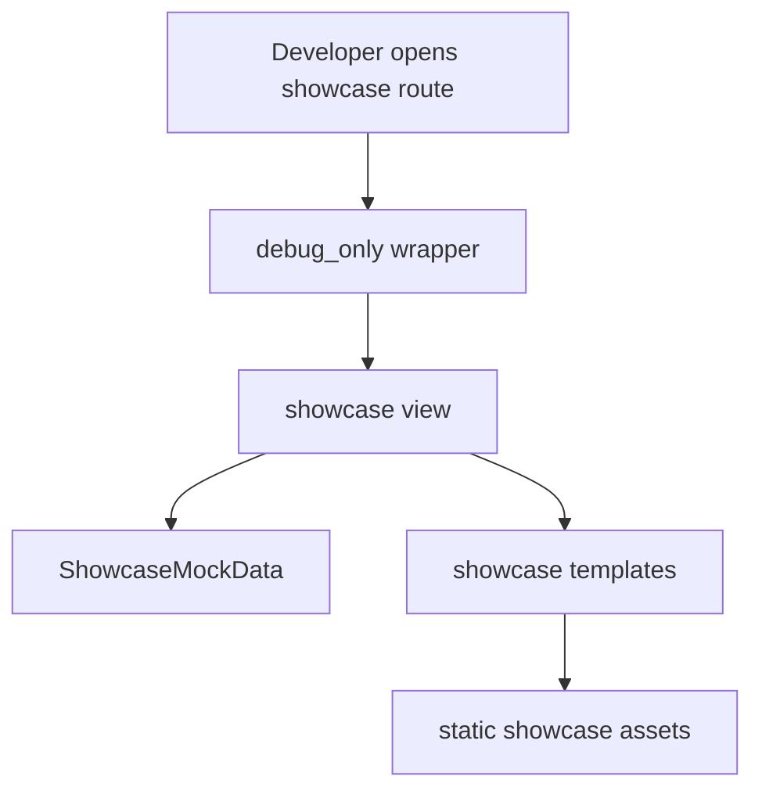

<!-- DOC_TYPE: CONCEPT -->

# Showcase Module

## Purpose

`codex_django.showcase` is the demonstration layer of the library.
It is not meant to be a production business module. Its job is to present the kinds of pages, flows, and UI structures that `codex-django` can generate or support inside a project.

In practice, showcase acts as a visual sandbox for:

- home and hub pages
- cabinet screens
- booking screens
- analytics views
- clients, staff, catalog, and conversations mock interfaces

This makes it useful as a presentation surface, a design reference, and a development aid when real project data is not yet wired in.

## What Makes It Different

Unlike the other top-level modules, `showcase` is intentionally static and demonstrational.
Its architecture is built around three ideas:

- all views are available only in `DEBUG`
- all data comes from in-memory mock structures
- templates are used to preview generated or future project screens

So the module does not model real domain state.
It simulates it well enough to show how the library's generated project experience can look.

## Main Building Blocks

### DEBUG-Only Access

All public showcase views are wrapped by `debug_only`.
That makes showcase explicitly a development and demo tool rather than a runtime feature for production users.

This is an important boundary:

- production modules provide real application behavior
- showcase provides safe, local-only visual demonstration

### Mock Data Source

`ShowcaseMockData` is the single source of demo data for showcase pages.
It contains in-memory structures for:

- staff
- clients
- conversations
- booking schedule and appointments
- reports
- catalog data
- dashboard snippets

This allows the showcase UI to behave like a real mini-project without requiring a database, fixtures, or live integrations.

### Demo Views

The views are intentionally thin.
They mostly take query parameters, choose the right mock-data method, and render a template.

Examples include:

- showcase hub
- cabinet dashboard
- staff and client directories
- booking pages
- conversation views
- reports
- catalog
- site settings previews

This means showcase is more of a presentation shell than an application service layer.

### Static Templates And Assets

The module ships its own templates and static files under `showcase/`.
These are not generic runtime templates for the main library features.
They are curated demo pages used to preview generated output and UI directions.

That makes showcase useful both for internal development and for explaining the library's capabilities to a human reader.

## Runtime Flow

## Role In The Repository

`showcase` is not part of the core runtime architecture in the same way as `core`, `system`, `booking`, `notifications`, or `cabinet`.
It is a demonstration companion layer.

Its role is to answer the question:
"What can a codex-django project look like once the library is wired in?"

That makes it especially useful for:

- early UI exploration
- feature presentation
- generated-project previews
- development without real backend state

## Relationship To Other Modules

- `cabinet` provides the reusable dashboard architecture; showcase demonstrates cabinet-like screens with mock data
- `booking` provides the runtime booking integration layer; showcase visualizes booking-oriented pages and states
- `system` and `notifications` influence the kinds of pages that can later be represented in showcase demos

## See Also

- `cabinet` for the actual reusable dashboard framework
- `booking` for the real booking adapter layer that showcase visually imitates
