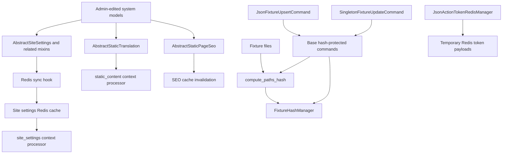

<!-- DOC_TYPE: CONCEPT -->

# System Module

## Purpose

`codex_django.system` is the project-state layer of the library.
If `core` provides generic Django primitives, `system` provides reusable models and workflows for data that belongs to the whole site rather than to one business feature.

This includes:

- site-wide settings
- editable static content
- integration credentials
- fixture import workflows
- utility mixins for common project entities
- a reusable user profile scaffold

The module is designed for the "system app" that many generated projects have near the center of their architecture.

## What Lives Here

### Site Settings Builder

The largest part of the module is the settings builder in `system.mixins.settings`.

Instead of forcing one monolithic settings model, `system` offers a composable family of abstract mixins:

- contact data
- geography and map data
- social links
- marketing and analytics identifiers
- technical toggles and script injections
- email infrastructure settings

Projects combine the mixins they need into one concrete site settings model that inherits from `AbstractSiteSettings`.

The key architectural idea is that site settings are modeled as editable project state, not as hardcoded values in Django settings files.

### Redis-Synced Site State

`AbstractSiteSettings` inherits synchronization behavior from `SiteSettingsSyncMixin`.
When a concrete settings model is saved, its concrete fields are flattened into a dictionary and synchronized to Redis through the site settings manager from `core`.

This enables fast template access through the `system.context_processors.site_settings()` context processor, which returns a safe `SettingsProxy` object.

So the runtime read path is:

1. project settings define the concrete settings model
2. model data is edited in admin
3. save hooks synchronize values to Redis
4. templates read `site_settings` from cached state

### Static Content And Lightweight CMS Behavior

`system.mixins.translations.AbstractStaticTranslation` provides a simple key-value content model for editable text snippets.
The `static_content()` context processor exposes these values to templates as a dictionary keyed by content name.

This is not a full CMS.
It is a lightweight content-management pattern for cases where projects need editable static fragments without introducing a larger content platform.

### Integration Credentials

`system.mixins.integrations` contains reusable credential mixins for external services such as:

- Google services
- Meta / Facebook
- Stripe
- CRM systems
- Twilio
- Seven.io
- ad-hoc JSON-based integrations

The main idea is to keep integration configuration near project state models, especially site settings, instead of scattering secrets and identifiers across arbitrary app models.

Several sensitive fields use encrypted model fields, which signals that `system` is intended to host operational configuration, not only public metadata.

### SEO State Ownership

`system.mixins.seo.AbstractStaticPageSeo` defines the model-side representation of static page SEO entries.
When a record is saved, it invalidates the relevant SEO Redis cache entry.

This complements `core`, where the selector and cache manager live.
In other words:

- `core` defines the SEO access path
- `system` defines one standard model shape for storing SEO data

### Fixture Workflows

`system.management.base_commands` and `system.redis.managers.fixtures` provide a reusable pattern for idempotent fixture imports.

The architecture has two important goals:

- avoid reloading unchanged fixtures
- allow grouped update commands to orchestrate several import steps

The hash-protected command computes a combined hash of fixture files and stores it in Redis.
If nothing changed, the import is skipped.
This makes repeated administrative update commands safer and cheaper in routine project maintenance.

On top of that base, `JsonFixtureUpsertCommand` handles the common project pattern where a Django-style JSON fixture is imported into a model with `update_or_create`.
Projects configure the fixture path, model, hash key, and lookup field; the library owns loading, validation, counters, and hash updates.

`SingletonFixtureUpdateCommand` covers site-wide singleton state such as `SiteSettings`.
It reads the first fixture row, updates only changed fields, saves only when necessary, and synchronizes through the site settings Redis manager.

Grouped commands can still use `BaseUpdateAllContentCommand`.
The base now provides optional section hooks so projects can keep readable command output without overriding the execution loop or losing `--force` forwarding.

### Action Token State

`system.redis.managers.JsonActionTokenRedisManager` provides generic temporary token storage for confirmation-like flows.
It creates URL-safe tokens, stores JSON payloads with a TTL, decodes payloads defensively, and deletes consumed tokens.

The manager is deliberately payload-agnostic.
Projects should keep appointment IDs, action names, proposed slots, and URL construction in their own service layer while reusing the library Redis mechanics.

### User Profile Scaffold

`system.mixins.user_profile.AbstractUserProfile` is a reusable abstract model for a user profile bound to `AUTH_USER_MODEL`.
It includes personal data, acquisition source metadata, notes, and helper methods such as full name and initials formatting.

This is a scaffold-level abstraction: projects are expected to inherit and adapt it rather than use it as a final domain model unchanged.

## Internal Architecture

## Role In The Repository

`system` is the administrative state layer of `codex-django`.
It is the place where projects store and operate the data that defines how the site behaves at runtime:

- what public text fragments exist
- what contact information is shown
- what integration keys are configured
- what fixtures have already been imported

This gives the repository a separation of responsibilities:

- `core` handles reusable technical plumbing
- `system` handles reusable project-state models and administrative workflows
- feature packages handle domain behavior

## See Also

- `core` for the lower-level Redis, SEO, i18n, and template infrastructure that `system` builds on
- `notifications` for delivery workflows that may depend on system-level credentials and settings
- `cabinet` for UI-oriented administrative and personal dashboard functionality
