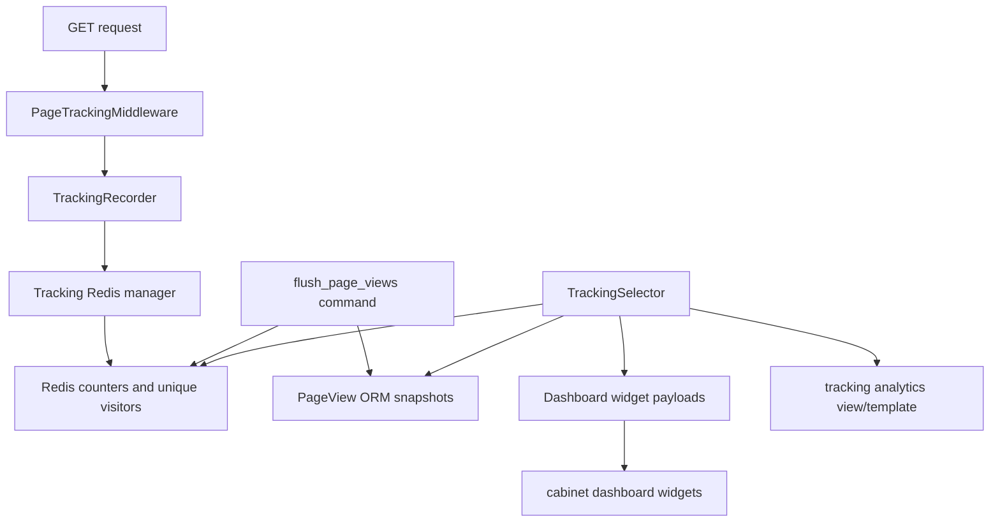

<!-- DOC_TYPE: CONCEPT -->

# Tracking Module

## Purpose

`codex_django.tracking` is the reusable page-analytics runtime for cabinet-oriented Codex projects.
It records eligible request traffic, stores short-term counters in Redis, exposes flushed snapshots through Django models, and turns the resulting data into cabinet dashboard widgets and analytics pages.

The module exists so projects do not need to rebuild the same middleware, aggregation, and dashboard wiring for simple internal traffic analytics.

## Main Building Blocks

### Request Recording

`tracking.middleware.PageTrackingMiddleware` records eligible `GET` responses after the main request finishes.
The middleware is intentionally defensive:

- it never blocks the response path
- it can ignore anonymous traffic
- it can optionally include redirects
- it skips configured path prefixes such as static assets or debug URLs

Actual request-to-counter conversion lives in `TrackingRecorder`, which normalizes the path, resolves the tracking day, and forwards the increment to the tracking manager.

### Runtime Settings

`tracking.settings.get_tracking_settings()` normalizes both `CODEX_TRACKING` and the legacy `CABINET_TRACKING` dicts into one immutable `TrackingSettings` object.

The settings surface controls:

- whether tracking is enabled
- whether Redis is enabled
- the Redis URL and key prefix
- TTL for Redis snapshots
- anonymous-user policy
- redirect tracking policy
- skipped URL prefixes
- the cabinet analytics URL and default analytics window

This keeps project policy configurable without duplicating the tracking runtime itself.

### Redis And Database Split

The tracking read/write path is intentionally split:

- Redis stores short-lived counters and unique-visitor sets for fast incremental writes
- `tracking.models.PageView` stores flushed daily snapshots for longer-lived reporting

`tracking.flush.flush_page_views()` and `flush_page_views` management commands bridge those two layers.
This gives projects a cheap write path for live traffic while still supporting stable reporting from ORM-backed data.

### Analytics Selector

`tracking.selector.TrackingSelector` is the read-only aggregation layer.
It merges flushed database snapshots with Redis counters and returns dashboard-ready payloads such as:

- total views
- unique visitors
- tracked page counts
- multi-day chart data
- top pages
- recent page-view tables

The selector returns typed widget contracts so cabinet templates stay declarative and thin.

### Cabinet Integration

The tracking app self-registers cabinet contributions through `tracking.cabinet` and `tracking.providers`.
On app startup it contributes:

- an Analytics topbar entry
- a staff-side sidebar item
- dashboard widgets backed by `DashboardSelector.extend(...)`
- a dedicated analytics page under the configured cabinet URL

This makes the module feel like a native part of the cabinet surface instead of an isolated metrics utility.

## Runtime Flow

## Role In The Repository

`tracking` is a runtime feature module, not just an internal helper.
It sits between infrastructure and cabinet UI:

- it depends on shared Redis and cabinet primitives from the rest of the runtime
- it exposes a ready-to-wire analytics feature for generated or hand-built Django projects

That makes it similar to `booking` or `notifications`: it is a reusable domain runtime with its own models, settings, selectors, and cabinet entrypoints.

## See Also

- `cabinet` for dashboard widgets, topbar entries, and reusable analytics page composition
- `core` for Redis infrastructure patterns reused by the tracking managers
- `system` for broader project-state settings that may live next to tracking configuration
