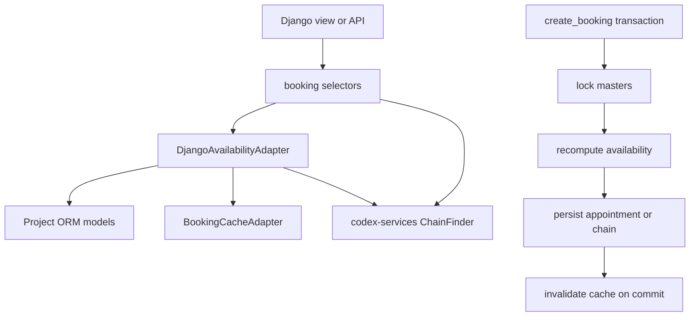

<!-- DOC_TYPE: CONCEPT -->

# Модуль Booking

## Назначение

`codex_django.booking` это Django adapter layer для booking engine, который живет в `codex-services`.
Его задача не в том, чтобы заново реализовать логику расписаний.
Его задача в том, чтобы связать Django project models и Django transaction semantics с provider-oriented интерфейсом движка.

Этот модуль одновременно дает Django-проекту:

- переиспользуемые abstract models для booking-сущностей
- ORM-based adapters, которые преобразуют проектные данные во вход движка
- selector-функции, удобные для views и feature-кода

Поэтому `booking` лучше понимать как интеграционный слой между доменными данными в Django и scheduling intelligence из `codex-services`.

## Архитектурная Граница

Основной алгоритм расчета записи делегирован `ChainFinder` и связанным DTO из `codex-services`.
`codex_django.booking` фокусируется на Django-специфичных задачах вокруг этого движка:

- как моделируются мастера, услуги, расписания и appointments
- как ORM-данные преобразуются в `BookingEngineRequest` и `MasterAvailability`
- как обрабатываются row locking и границы транзакций при создании записи
- как безопасно инвалидируется busy-slot cache

Это разделение важно, потому что сами scheduling rules остаются переиспользуемыми между фреймворками, а Django-проект при этом получает практичный способ интеграции.

## Основные Строительные Блоки

### Компонованные Booking-Модели

Пакет `mixins` задает abstract model mixins для основных booking-сущностей:

- `AbstractBookableMaster`
- `AbstractBookableService`
- `AbstractBookableAppointment`
- `AbstractWorkingDay`
- `MasterDayOffMixin`
- `AbstractBookingSettings`

Это не готовые project models.
Это scaffold-примитивы, которые позволяют проекту сохранить свои foreign keys, категории, статусы и бизнес-детали, но при этом соответствовать ожиданиям adapter layer.

Ключевой дизайн-выбор здесь это composability вместо жестко зашитой схемы.

### Availability Adapter

`DjangoAvailabilityAdapter` это центральная часть модуля.
Именно он переводит состояние Django ORM в provider data structures, которых ожидает booking engine.

Он отвечает за:

- построение engine request по service ids и master selections
- определение, какие мастера могут выполнять какие услуги
- сбор working hours, break intervals, days off и busy intervals
- построение `MasterAvailability`
- блокировку строк мастеров во время создания записи

По сути этот adapter выступает переводчиком контракта между Django models и `ChainFinder`.

### High-Level Selectors

В `booking.selectors` находятся pure-function точки входа, которые используют views и generated feature code:

- `get_available_slots()`
- `get_nearest_slots()`
- `get_calendar_data()`
- `create_booking()`

Такая организация выносит orchestration из model methods.
Благодаря этому логику легче переиспользовать в views, API, management commands и будущем generated code.

### Cache Adapter

`BookingCacheAdapter` это тонкий мост к Redis booking cache manager из `core`.
Стратегия кэширования здесь намеренно узкая:

- кэшируются busy intervals по мастеру и дате
- свободные окна вычисляются динамически на основе этих интервалов
- после успешного изменения бронирования инвалидируются только затронутые master/date записи

Это позволяет делать cache invalidation точечной и не хранить производные slot maps как главный источник истины.

### Синхронизация Booking Settings

`AbstractBookingSettings` задает конфигурируемые booking defaults:

- размер шага сетки времени
- default buffer between appointments
- ограничения на запись заранее
- fallback working hours

Его save hook синхронизирует настройки в Redis, следуя тому же общему паттерну, который используется в других частях репозитория для runtime-accessed административного состояния.

## Модель Конкурентности

Самый важный архитектурный вопрос в этом модуле это не сам расчет слотов, а безопасное создание записи под конкурирующей нагрузкой.

`create_booking()` следует защитному сценарию:

1. открыть транзакцию
2. заблокировать нужные строки мастеров
3. пересчитать availability под блокировкой
4. проверить, что нужное время все еще доступно
5. сохранить appointment или multi-service chain
6. инвалидировать кэш только после commit транзакции

Такой дизайн защищает от типичной ситуации, когда слот был свободен в момент показа пользователю, но занят к моменту подтверждения.

Для multi-service booking модуль вводит `BookingPersistenceHook` protocol.
Это оставляет persistence сложных booking chains на стороне конкретного проекта, но сохраняет общую логику locking и revalidation.

## Runtime Flow

## Роль В Репозитории

`booking` это domain adapter layer для appointment scheduling.
Именно здесь репозиторий превращает универсальные возможности booking engine в Django-совместимые строительные блоки.

Поэтому он отличается от:

- `core`, который дает общие инфраструктурные примитивы
- `system`, который дает project-state models и admin workflow
- `notifications`, который занимается dispatch уведомлений вокруг доменных событий

`booking` расположен ближе к предметному поведению, чем эти модули, но при этом все еще остается adapter library, а не готовым конечным booking-приложением.

## См. Также

- `notifications` для confirmation и reminder workflow поверх booking events
- `system` для settings models, которые могут хранить project-level booking defaults
- `codex-services` для самого slot-finding и chain-solving engine, с которым интегрируется этот модуль
