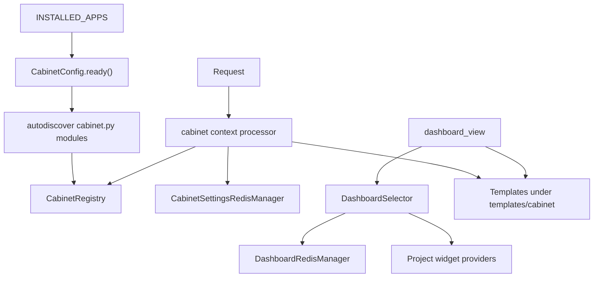

<!-- DOC_TYPE: CONCEPT -->

# Модуль Cabinet

## Назначение

`codex_django.cabinet` это внутреннее dashboard-приложение библиотеки.
В отличие от публичной части сгенерированного проекта, cabinet разрабатывается прямо внутри библиотеки как переиспользуемый и изолированный app со своими шаблонами, static assets, registry и runtime-конвенциями.

Его задача не сводится только к рендерингу страниц.
Он дает структурированный способ, с помощью которого проектные модули могут добавлять:

- навигационные секции
- dashboard widgets
- topbar actions
- cabinet-specific settings

То есть этот модуль работает одновременно как UI shell и как extension framework для административных и пользовательских dashboard-сценариев.

## Архитектурная Позиция

`cabinet` устроен иначе, чем остальные верхнеуровневые пакеты:

- `core`, `system`, `booking` и `notifications` в основном дают backend-примитивы
- `cabinet` дает переиспользуемую application surface с правилами UI-композиции

Он все еще является частью библиотеки, но по поведению больше похож на упакованное mini-application, чем на простой utility module.

Именно поэтому его архитектура строится вокруг registration, templating, namespacing и cacheable view data, а не вокруг одного набора mixins или selectors.

## Основные Принципы

### Полностью Изолированный App

Cabinet намеренно изолирован:

- собственные шаблоны в `templates/cabinet/`
- собственные static assets в `static/cabinet/`
- собственные `AppConfig` и urls
- собственный context processor
- отказоустойчивый механизм SiteSettingsService с DB-fallback и кэшированием в Redis

Это позволяет переиспользовать cabinet в сгенерированных проектах, не смешивая его с публичной структурой сайта.

### Модель Двух Пространств

Cabinet содержит два независимых пространства в рамках одного app:

| Пространство | URL-префикс | Базовый шаблон | Аудитория |
|-------------|------------|----------------|----------|
| `staff` | `/cabinet/` | `base_cabinet.html` | Владельцы и администраторы |
| `client` | `/cabinet/my/` | `base_client.html` | Конечные клиенты |

Для каждого пространства topbar, sidebar и shortcuts регистрируются отдельно через `declare(space=...)`.
CSS-токены тоже независимы: staff использует `:root { --cab-* }`, client — `.cab-wrapper--client { --cab-* }`.
Проекты могут переопределять обе палитры независимо.

### Registry-Based Extension

Ключевой механизм расширения здесь это in-memory `CabinetRegistry`.
Feature apps публикуют свои cabinet-вклады через `cabinet.py`, а `CabinetConfig.ready()` загружает эти модули через `autodiscover_modules("cabinet")`.

Публичная точка входа это `declare(...)`, которая принимает:

- `space` — `"staff"` или `"client"` (v2 API)
- `topbar` — `TopbarEntry` для staff topbar dropdown
- `sidebar` — список `SidebarItem` для sub-навигации модуля
- `shortcuts` — быстрые ссылки в topbar
- `dashboard_widget` — объявление `DashboardWidget`

Унаследованный v1 (`section=CabinetSection(...)`) поддерживается для обратной совместимости.

Этот дизайн делает feature-модули явными.
Проекту не нужно хрупкое introspection-поведение или неявная convention-only магия, чтобы встроиться в dashboard.

### Runtime Extension Seams

Cabinet-pass `0.3.1` убрал необходимость лезть в private registry state или копировать view setup в проектах.
Публичный runtime layer теперь дает:

- `configure_space()` и `CabinetSpaceConfig` для staff/client defaults
- `CabinetRuntimeResolver` и `CabinetRequestContext` для request-scoped определения module/space
- filtered registry readers для topbar, sidebar, shortcuts и dashboard widgets
- `CabinetModuleMixin`, `CabinetTemplateView`, `StaffRequiredMixin` и `OwnerRequiredMixin` для переиспользуемой сборки views
- `ModalPresenter` и `present_modal_state()` для преобразования modal state в типизированные cabinet sections

Так проектная policy остается в проекте, а повторяемая cabinet-механика живет в библиотеке.

### Неизменяемые Контракты — Пакет Types

Все контракты регистрации и данных определены как frozen dataclass-структуры, организованные в пакете `cabinet/types/`:

| Модуль | Типы |
|--------|------|
| `types/nav.py` | `TopbarEntry`, `SidebarItem`, `Shortcut` |
| `types/widgets.py` | `MetricWidgetData`, `TableWidgetData`, `ListWidgetData`, `TableColumn`, `ListItem` |
| `types/components.py` | `DataTableData`, `CalendarGridData`, `CardGridData`, `ListViewData`, `SplitPanelData` + вспомогательные типы |
| `types/registry.py` | `DashboardWidget`, `NavAction`, `CabinetSection` (deprecated) |

Навигационные и registry-типы имеют `frozen=True` — экземпляры неизменяемы после создания.
Поскольку registry живет в глобальной process memory, immutable declarations уменьшают риск случайной мутации из views или middleware.

### Навигация По Группам

Cabinet поддерживает несколько navigation groups, сейчас в том числе:

- `admin`
- `services`
- `client`

Context processor фильтрует секции и widgets по:

- текущей navigation group
- permissions текущего пользователя

Благодаря этому один и тот же cabinet app может держать несколько разных dashboard-представлений без дублирования всего framework-слоя под каждую аудиторию.

## Основные Строительные Блоки

### Context Processor

`cabinet.context_processors.cabinet()` это мост между registry и шаблонами.
Он пробрасывает:

- отфильтрованную навигацию
- topbar actions
- dashboard widgets
- кэшированные настройки кабинета

Его поведение намеренно защитное: даже анонимный пользователь получает ожидаемые ключи с пустыми значениями, чтобы шаблоны не падали.

### Dashboard Selector

`cabinet.selector.dashboard.DashboardSelector` это точка входа для агрегации данных дашборда.
Он позволяет регистрировать providers с:

- cache key
- cache TTL
- либо flat provider function, либо typed adapter

В модуле уже есть adapter-формы для типовых widget-данных: metrics, tables и lists.

Так cabinet получает расширяемый слой данных, не превращая все widget providers в один перегруженный view.

### Redis-Backed Cabinet State

Cabinet использует унифицированные механизмы для работы с состоянием:

- настройки кабинета (интегрированы с Site Settings через SiteSettingsService)
- кэш данных dashboard providers

`CabinetSettings` и `SiteSettings` теперь синхронизируются в Redis по общему ключу `site_settings`.
`SiteSettingsService` обеспечивает прозрачный DB-fallback: если Redis недоступен или пуст, данные агрегируются напрямую из базы данных (объединяя модель SiteSettings и настройки брендинга CabinetSettings), что гарантирует работоспособность UI в любых условиях.
Результаты dashboard providers кэшируются отдельно по provider key, что позволяет точечно инвалидировать только один widget, когда его данные изменились.

### Контентные Компоненты

Cabinet поставляет пять переиспользуемых шаблонных компонентов в `cabinet/templates/cabinet/components/`:

| Шаблон | Тип контракта | Взаимодействие |
|--------|--------------|----------------|
| `data_table.html` | `DataTableData` | Alpine поиск/фильтры, HTMX actions по строкам |
| `calendar_grid.html` | `CalendarGridData` | CSS Grid layout, HTMX клик по слоту/событию |
| `card_grid.html` | `CardGridData` | Alpine переключение grid/list |
| `list_view.html` | `ListViewData` | Alpine поиск, HTMX клик по строке |
| `split_panel.html` | `SplitPanelData` | HTMX загрузка detail panel |

Каждый компонент получает единственный типизированный объект-контракт, когда страничный шаблон рендерит include компонента с `obj=obj`.
Backend вычисляет все значения; шаблоны не содержат бизнес-логики.

**Паттерн модальных окон:** компоненты не встраивают модалки.
Вместо этого они диспатчат `$dispatch('open-modal', {url: '...'})`.
Страничный include `cabinet/includes/_modal_base.html` слушает событие и загружает содержимое через HTMX.

**CSS:** там где возможно используется стандартный Bootstrap 5.
Кастомный CSS в `cab_components.css` покрывает calendar grid (CSS Grid layout) и split panel (двухколоночный grid).

### Views И Template Shell

Текущие built-in views здесь намеренно тонкие:

- dashboard index
- страница site settings
- HTMX tab partials для настроек

Такая тонкость осознанна.
Cabinet проектировался так, чтобы:

- registry задавал структуру
- selectors поставляли данные
- templates собирали UI из переиспользуемых компонентов
- проекты могли переопределять или расширять страницы стандартными Django-механизмами

Site settings следуют тому же правилу.
`SiteSettingsService` дает hooks для выбора settings model, обнаружения tabs, подготовки save context, проверки save permission и сохранения изменений.
Проекты могут заменять policy-части без копирования built-in settings view flow.

## Runtime Flow

## Роль В Репозитории

`cabinet` это packaged dashboard surface внутри `codex-django`.
Он дает переиспользуемую структуру, на базе которой можно собирать:

- административную навигацию
- service-oriented dashboards
- client-facing cabinet views

не заставляя каждый проект заново придумывать весь shell с нуля.

Из-за этого это один из самых application-like модулей в репозитории.
Он остается библиотечным компонентом, но при этом предоставляет уже целый compositional UI framework, а не только backend helpers.

## Связь С Другими Модулями

- `system` может давать настройки и контент, которые cabinet показывает или редактирует
- `booking` может регистрировать cabinet sections и dashboard widgets для scheduling-сценариев
- `notifications` может добавлять метрики или actions, связанные с коммуникациями
- `core` дает базовый Redis layer, на котором построены cabinet-specific managers

## См. Также

- `system` для project-state models, которые часто лежат под страницами кабинета
- `booking` для feature-модулей, которые могут встраиваться в cabinet registry
