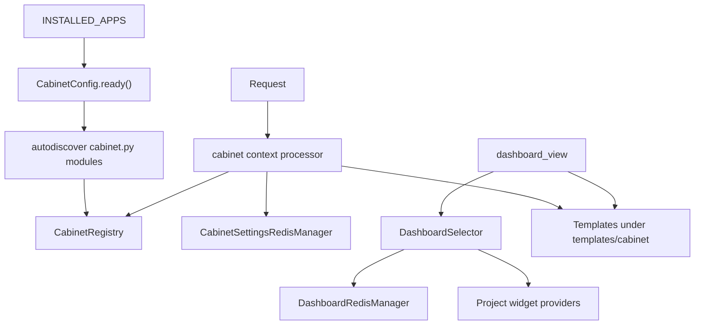

<!-- DOC_TYPE: CONCEPT -->

# Модуль Cabinet

## Назначение

`codex_django.cabinet` это внутреннее dashboard-приложение библиотеки.
В отличие от публичной части сгенерированного проекта, cabinet разрабатывается прямо внутри библиотеки как переиспользуемый и изолированный app со своими шаблонами, static assets, registry и runtime-конвенциями.

Его задача не сводится только к рендерингу страниц.
Он дает структурированный способ, с помощью которого проектные модули могут добавлять:

- навигационные секции
- dashboard widgets
- topbar actions
- cabinet-specific settings

То есть этот модуль работает одновременно как UI shell и как extension framework для административных и пользовательских dashboard-сценариев.

## Архитектурная Позиция

`cabinet` устроен иначе, чем остальные верхнеуровневые пакеты:

- `core`, `system`, `booking` и `notifications` в основном дают backend-примитивы
- `cabinet` дает переиспользуемую application surface с правилами UI-композиции

Он все еще является частью библиотеки, но по поведению больше похож на упакованное mini-application, чем на простой utility module.

Именно поэтому его архитектура строится вокруг registration, templating, namespacing и cacheable view data, а не вокруг одного набора mixins или selectors.

## Основные Принципы

### Полностью Изолированный App

Cabinet намеренно изолирован:

- собственные шаблоны в `templates/cabinet/`
- собственные static assets в `static/cabinet/`
- собственные `AppConfig` и urls
- собственный context processor
- собственный Redis-backed settings cache

Это позволяет переиспользовать cabinet в сгенерированных проектах, не смешивая его с публичной структурой сайта.

### Registry-Based Extension

Ключевой механизм расширения здесь это in-memory `CabinetRegistry`.
Feature apps публикуют свои cabinet-вклады через `cabinet.py`, а `CabinetConfig.ready()` загружает эти модули через `autodiscover_modules("cabinet")`.

Публичная точка входа это `declare(...)`, через которую регистрируются:

- `CabinetSection`
- `DashboardWidget`
- topbar actions
- global actions

Этот дизайн делает feature-модули явными.
Проекту не нужно хрупкое introspection-поведение или неявная convention-only магия, чтобы встроиться в dashboard.

### Неизменяемые Контракты

Контракты регистрации заданы frozen dataclass-структурами:

- `CabinetSection`
- `DashboardWidget`
- `NavAction`

Это важный архитектурный выбор.
Поскольку registry живет в глобальной process memory, immutable declarations уменьшают риск случайной мутации из views или middleware.

### Навигация По Группам

Cabinet поддерживает несколько navigation groups, сейчас в том числе:

- `admin`
- `services`
- `client`

Context processor фильтрует секции и widgets по:

- текущей navigation group
- permissions текущего пользователя

Благодаря этому один и тот же cabinet app может держать несколько разных dashboard-представлений без дублирования всего framework-слоя под каждую аудиторию.

## Основные Строительные Блоки

### Context Processor

`cabinet.context_processors.cabinet()` это мост между registry и шаблонами.
Он пробрасывает:

- отфильтрованную навигацию
- topbar actions
- dashboard widgets
- кэшированные настройки кабинета

Его поведение намеренно защитное: даже анонимный пользователь получает ожидаемые ключи с пустыми значениями, чтобы шаблоны не падали.

### Dashboard Selector

`cabinet.selector.dashboard.DashboardSelector` это точка входа для агрегации данных дашборда.
Он позволяет регистрировать providers с:

- cache key
- cache TTL
- либо flat provider function, либо typed adapter

В модуле уже есть adapter-формы для типовых widget-данных: metrics, tables и lists.

Так cabinet получает расширяемый слой данных, не превращая все widget providers в один перегруженный view.

### Redis-Backed Cabinet State

Cabinet использует отдельные Redis managers для двух видов состояния:

- настройки кабинета
- кэш данных dashboard providers

`CabinetSettings` оформлен как singleton и синхронизируется в Redis при сохранении.
Результаты dashboard providers кэшируются отдельно по provider key, что позволяет точечно инвалидировать только один widget, когда его данные изменились.

### Views И Template Shell

Текущие built-in views здесь намеренно тонкие:

- dashboard index
- страница site settings
- HTMX tab partials для настроек

Такая тонкость осознанна.
Cabinet проектировался так, чтобы:

- registry задавал структуру
- selectors поставляли данные
- templates собирали UI
- проекты могли переопределять или расширять страницы стандартными Django-механизмами

## Runtime Flow

## Роль В Репозитории

`cabinet` это packaged dashboard surface внутри `codex-django`.
Он дает переиспользуемую структуру, на базе которой можно собирать:

- административную навигацию
- service-oriented dashboards
- client-facing cabinet views

не заставляя каждый проект заново придумывать весь shell с нуля.

Из-за этого это один из самых application-like модулей в репозитории.
Он остается библиотечным компонентом, но при этом предоставляет уже целый compositional UI framework, а не только backend helpers.

## Связь С Другими Модулями

- `system` может давать настройки и контент, которые cabinet показывает или редактирует
- `booking` может регистрировать cabinet sections и dashboard widgets для scheduling-сценариев
- `notifications` может добавлять метрики или actions, связанные с коммуникациями
- `core` дает базовый Redis layer, на котором построены cabinet-specific managers

## См. Также

- `system` для project-state models, которые часто лежат под страницами кабинета
- `booking` для feature-модулей, которые могут встраиваться в cabinet registry
