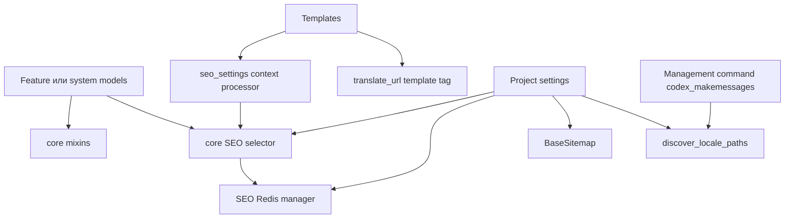

<!-- DOC_TYPE: CONCEPT -->

# Модуль Core

## Назначение

`codex_django.core` это общий инфраструктурный слой, на который опираются Django-проекты, собранные через `codex-django` или использующие его как библиотеку.
Это не бизнес-модуль и не одна предметная область. Здесь собраны сквозные строительные блоки, которые одновременно нужны многим частям проекта:

- переиспользуемые model mixins
- доступ к SEO-данным из шаблонов
- discovery для i18n и вспомогательные URL-хелперы
- базовая логика sitemap
- Redis-кэш для инфраструктурных данных
- небольшие framework-level интеграции для шаблонов и management commands

Из-за этого `core` выступает как фундамент проекта: сначала он дает общие Django-примитивы, а уже поверх них строятся feature-модули.

## Что Находится Внутри

### Model Mixins

В `core.mixins.models` лежат абстрактные Django mixin-классы:

- `TimestampMixin`
- `ActiveMixin`
- `SeoMixin`
- `OrderableMixin`
- `SoftDeleteMixin`
- `UUIDMixin`
- `SlugMixin`

Они стандартизируют повторяющиеся поля и поведение моделей, чтобы в проектах не приходилось заново собирать базовые сущности вручную.

### SEO Интеграция

SEO-путь здесь построен вокруг двух частей:

- `core.seo.selectors.get_static_page_seo()`
- `core.context_processors.seo_settings()`

Селектор берет модель из настройки `CODEX_STATIC_PAGE_SEO_MODEL`, читает данные, кэширует их через SEO Redis manager и отдает плоский словарь, удобный для шаблонов.
Context processor определяет текущий `url_name` и пробрасывает результат в шаблон как `seo`.

То есть `core` не владеет самим SEO-контентом, а предоставляет стандартный путь доступа и кэширования, в который подключаются другие модели проекта.

### Redis Инфраструктура

В `core.redis.managers` находятся базовый адаптер Redis и несколько специализированных менеджеров:

- `BaseDjangoRedisManager` строит ключи с project prefix и читает `REDIS_URL`
- `SeoRedisManager` кэширует SEO-данные статических страниц
- `DjangoSiteSettingsManager` кэширует настройки сайта и отдает template-friendly proxy
- `BookingCacheManager` кэширует занятые интервалы записи по мастеру и дате
- `NotificationsCacheManager` кэширует данные, связанные с уведомлениями

Во всем модуле используется единый паттерн: async-first методы плюс sync-обертки для обычного Django-кода.
Это дает верхним слоям единый способ работать с Redis без повторной настройки клиента и схемы ключей.

### Internationalization Helpers

`core.i18n.discovery.discover_locale_paths()` ищет locale-директории сразу в нескольких схемах проекта:

- централизованный `locale/<domain>/...`
- локальный `locale/` у верхнеуровневого приложения
- локальный `features/<name>/locale/`

`core.templatetags.codex_i18n.translate_url` дополняет это template tag'ом для переключения языка по текущему URL.

Вместе эти части поддерживают модульную стратегию переводов, на которую рассчитаны Codex-проекты.

### Sitemap Base

`core.sitemaps.BaseSitemap` это переиспользуемый базовый класс для sitemap, в котором уже зафиксированы общие правила:

- i18n включен по умолчанию
- canonical domain берется из settings
- для ссылок принудительно используется HTTPS
- формируются alternate language links и `x-default`
- есть fallback-поиск именованных URL через namespaces

Это убирает повторяющийся sitemap-boilerplate из прикладных приложений.

### Management Support

`core.management.commands.codex_makemessages` добавляет модульный workflow поверх стандартного Django `makemessages`.
Вместо одного общего прохода по проекту команда определяет отдельные домены по шаблонам, приложениям и feature-папкам, после чего запускает извлечение переводов отдельно для каждого домена.

Это соответствует архитектуре, где переводы организованы по поддоменам проекта, а не как один глобальный каталог сообщений.

## Внутренняя Архитектура

## Роль В Репозитории

`core` это базовый слой для framework-level переиспользования.
Если другие пакеты описывают прикладные возможности вроде booking или notifications, то `core` описывает общие механики, которые делают эти возможности удобными внутри Django-проекта.

Поэтому внутри `core` собраны темы, которые на первый взгляд выглядят разнородно:
их объединяет не предметная область, а то, что они относятся ко всему проекту сразу.

## См. Также

- `system` для проектных настроек, фикстур и более широких infrastructure mixins
- `booking` для booking-специфичных mixins и adapters поверх общего слоя
- `notifications` для orchestration-слоя уведомлений
