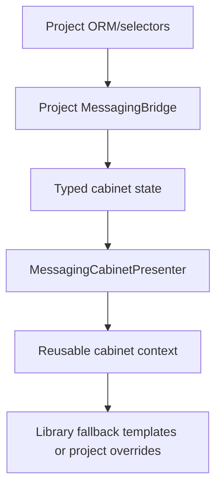

<!-- DOC_TYPE: CONCEPT -->

# Messaging Module

## Назначение

`codex_django.messaging` — это Django-facing orchestration layer для messaging-задач в Codex-проектах. Он заменяет `codex_django.notifications` как основной публичный пакет и расширяет библиотеку за пределы одного только dispatch.

Пакет объединяет:

- localized content selection
- payload construction
- queue/direct delivery adapters
- abstract Django models для messaging-данных
- audience/campaign batching primitives
- cabinet contracts, bridge protocol, presenters, workflows, navigation helpers
  и reusable fallback templates

## Что осталось за проектом

Библиотека не берет на себя:

- concrete models
- admin wiring
- URL routes и views
- project-specific inbox/campaign templates
- worker callback endpoints

Эти части должны реализовываться в проекте поверх библиотечных контрактов.

Библиотека при этом поставляет reusable `cabinet/messaging/...` partials и
fallback pages. Проект по-прежнему владеет URLs, views, bridge implementation и
template overrides.

## Cabinet flow

