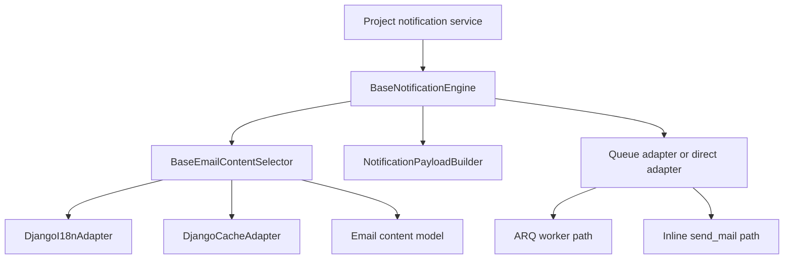

<!-- DOC_TYPE: CONCEPT -->

# Модуль Notifications

## Назначение

`codex_django.notifications` это Django-ориентированный orchestration-слой для уведомлений.
Он не реализует низкоуровневую доставку сам по себе. Вместо этого он адаптирует уведомления под типичные Django-runtime сценарии:

- ORM-backed выбор контента
- Django i18n language switching
- Redis-backed caching
- transaction-aware отправка задач в очередь
- optional direct delivery для простых или локальных окружений

За счет этого проекты могут собирать собственные notification services, не переписывая каждый раз одну и ту же интеграционную обвязку.

## Главная Идея

Модуль намеренно разрезан на небольшие роли, которые работают вместе:

- модель для редактируемого notification content
- selector для получения и кэширования локализованного текста
- payload builder для сериализуемых словарей
- engine для orchestration subject resolution и dispatch
- adapters, которые решают, как именно будет запущена доставка

То есть это не просто "код отправки email в одном месте".
Это составной notification pipeline.

## Основные Строительные Блоки

### Редактируемая Модель Контента

`BaseEmailContentMixin` задает форму модели для блоков notification content, которые хранятся в базе данных.
Записи имеют ключ, категорию и описание, поэтому подходят для admin-managed тем писем и текстовых фрагментов.

За счет этого появляется разделение между:

- notification logic в Python-коде
- notification wording в данных

Это особенно важно для многоязычных проектов и для систем, где тексты часто меняются.

### Выбор Локализованного Контента

`BaseEmailContentSelector` отвечает за получение текста по ключу и языку.
Его путь чтения выглядит так:

1. построить cache key
2. проверить кэш
3. войти в translation override
4. прочитать запись из модели
5. положить результат в кэш

Тем самым локализация и кэширование становятся частью процесса получения контента, а не размазываются по каждому sender-методу.

### Построение Payload

`NotificationPayloadBuilder` создает обычные словари, пригодные для сериализации в очередь.
Он поддерживает два разных режима доставки:

- `template`: worker получает template name и context, а рендеринг делает позже
- `rendered`: payload уже содержит готовый HTML/text content

Это важная архитектурная граница, потому что она отделяет orchestration уведомления от стратегии рендеринга.
Проект сам выбирает, где должен происходить рендеринг: до постановки в очередь или уже внутри worker.

### Dispatch Engine

`BaseNotificationEngine` связывает selector, builder и queue adapter.
Он получает локализованный subject, создает `notification_id`, выбирает режим payload и делегирует фактическую доставку выбранному adapter.

С архитектурной точки зрения это главный extension point для проекта.
Ожидаемый паттерн такой: проект наследует этот engine и добавляет свои `send_*` методы под конкретные события, например подтверждение записи или сброс пароля.

### Delivery Adapters

В модуле есть несколько adapters с разными зонами ответственности:

- `DjangoQueueAdapter` отправляет задачи через ARQ client и умеет откладывать enqueue до commit транзакции
- `DjangoDirectAdapter` отправляет уведомления inline без worker
- `DjangoCacheAdapter` связывает content lookup с Redis cache manager
- `DjangoI18nAdapter` оборачивает Django language override
- `DjangoArqClient` задает границу взаимодействия с ARQ

Ключевой дизайн-выбор здесь в том, что engine не знает, будет доставка queued или direct.
Это решение вынесено в adapters.

## Runtime Flow

## Роль В Архитектуре

`notifications` работает как boundary-модуль между кодом проекта и нижележащей Codex notification infrastructure.
Он дает Django-проекту переиспользуемый orchestration layer, при этом оставляя concrete delivery strategy заменяемой.

Из-за этого пакет одинаково полезен в нескольких режимах:

- полноценная асинхронная доставка через очередь и worker
- transaction-safe enqueueing из обычных Django views
- direct delivery в локальной или упрощенной среде

## Связь С Другими Модулями

- `core` дает Redis manager, который используется notification cache adapter
- `system` может хранить settings и credentials, от которых зависят notification services
- сам `notifications` фокусируется на выборе контента, сборке payload и запуске доставки

## См. Также

- `system` для site settings и integration credentials, которые могут участвовать в notification workflow
- `core` для общей Redis-инфраструктуры, на которой стоит cache adapter
