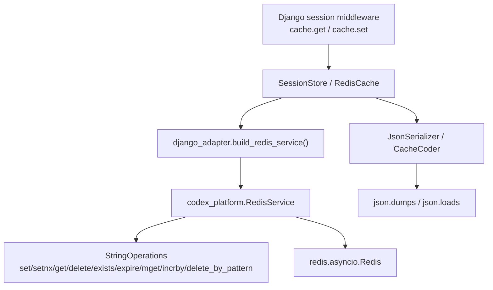

<!-- DOC_TYPE: CONCEPT -->

# Redis Cache и Session — архитектура

## Назначение

`codex_django.sessions` и `codex_django.cache` предоставляют нативные Django-бэкенды
для сессий и кэша поверх асинхронного Redis-стека `codex-platform`.
Они позволяют downstream-проектам использовать стандартные Django API без пакета
`django-redis` и без pickle-сериализации.

Этот слой стоит на уровень выше предметно-ориентированных Redis-менеджеров
(`SeoRedisManager`, `BookingCacheManager` и т. д.) и намеренно отделён от них.
Менеджеры домена имеют опциональный обход через `_is_disabled()` /
`CODEX_REDIS_ENABLED`; session- и cache-бэкенды не должны молча отключаться —
сбой Redis обязан привести к явной ошибке.

## Компоненты

### SessionStore

`codex_django.sessions.backends.redis.SessionStore` — подкласс
`django.contrib.sessions.backends.base.SessionBase`.

- Payload = Django **encoded string** (`SessionBase.encode()` / `.decode()`).
  Формат контролируется `SESSION_SERIALIZER`; испорченный payload безопасно
  возвращает `{}` через `decode()`.
- Redis-ключ: `{PROJECT_NAME}:{CODEX_SESSION_KEY_PREFIX}:{session_key}`.
- TTL = `self.get_expiry_age()` (из `SESSION_COOKIE_AGE`).
- `must_create=True` → атомарный `SET NX EX` → `CreateError` при коллизии.
- Обновление существующей сессии → `SETEX`; `UpdateError`, если ключ исчез.
- Async-ядро (`aexists / acreate / aload / asave / adelete`); sync-обёртки
  через `asgiref.sync.async_to_sync` — паттерн, стандартный для
  всех codex-django Redis-менеджеров.

### RedisCache

`codex_django.cache.backends.redis.RedisCache` — подкласс
`django.core.cache.backends.base.BaseCache`.

Реализует полный практический Django cache contract:

| Метод | Redis-примитив |
|---|---|
| `get` | `GET` |
| `set` | `SETEX` / `SET` / `DEL` (по timeout) |
| `add` | `SET NX EX` (атомарно) |
| `delete` | `EXISTS` + `DEL` |
| `has_key` | `EXISTS` |
| `touch` | `EXPIRE` / `PERSIST` / `DEL` |
| `get_many` | `MGET` |
| `set_many` | серия `SETEX` |
| `delete_many` | серия `DEL` |
| `incr` / `decr` | `INCRBY` |
| `clear` | `SCAN + DEL` по маске `{KEY_PREFIX}:*` |

### JsonSerializer

`codex_django.cache.serializers.JsonSerializer` — компактный UTF-8 JSON
(`json.dumps(ensure_ascii=False)`). Не поддерживаемые типы → `TypeError`,
pickle fallback отсутствует. Заменяем через
`OPTIONS["SERIALIZER"] = "dotted.path.ToSerializer"`.

### CacheCoder

`codex_django.cache.values.CacheCoder` — явные хелперы для типов, которые
JSON-сериализатор отклоняет: `datetime`, `date`, `timedelta`, `Decimal`,
`UUID`, `set`, `bytes`. Вызываются на стороне приложения явно, а не
прозрачно скрываются внутри бэкенда — это сохраняет совместимость ключей
Redis с другими клиентами и исключает breaking-change при изменении логики.

### Shared adapter

`codex_django.core.redis.django_adapter` — тонкий внутренний модуль:
`build_redis_client / build_redis_service / namespaced_key`. Не несёт
DEBUG-bypass логики `BaseDjangoRedisManager`.

## Диаграмма

## Связь с менеджерами домена

Доменные менеджеры наследуют `BaseDjangoRedisManager` с обходом `_is_disabled()`.
Session- и cache-бэкенды используют `django_adapter` напрямую, не наследуя этот обход.

## Поведение при ошибке

`RedisConnectionError` и `RedisServiceError` прокидываются к вызывающему без
перехвата. Если проекту нужна graceful degradation — она реализуется на уровне
application (try/except в view, HTTP 503), а не внутри бэкенда.
