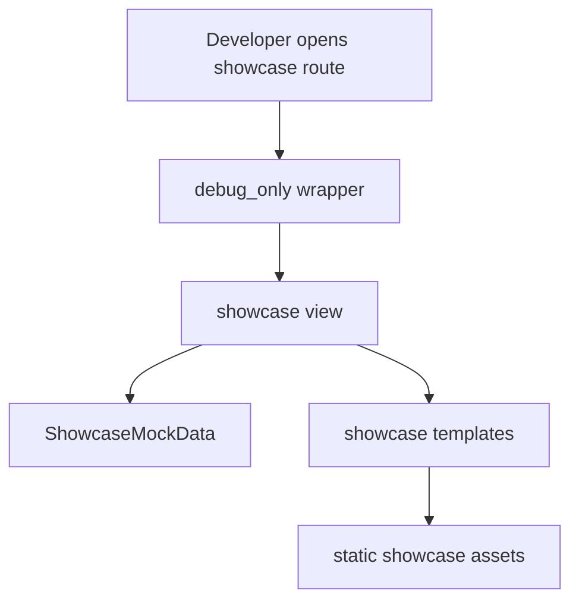

<!-- DOC_TYPE: CONCEPT -->

# Модуль Showcase

## Назначение

`codex_django.showcase` это демонстрационный слой библиотеки.
Он не задуман как production-модуль с реальной бизнес-логикой. Его задача показать, какие страницы, сценарии и UI-структуры `codex-django` умеет генерировать или поддерживать внутри проекта.

На практике showcase выступает как визуальная sandbox-среда для:

- home и hub-страниц
- cabinet-экранов
- booking-страниц
- analytics views
- mock-интерфейсов для staff, clients, catalog и conversations

Из-за этого он полезен как презентационный слой, как reference для дизайна и как вспомогательная среда разработки, когда реальные проектные данные еще не подключены.

## Чем Он Отличается

В отличие от остальных верхнеуровневых модулей, `showcase` специально сделан статичным и демонстрационным.
Его архитектура строится вокруг трех идей:

- все views доступны только в `DEBUG`
- все данные приходят из in-memory mock-структур
- шаблоны используются для предпросмотра сгенерированных или будущих project screens

То есть модуль не моделирует реальное доменное состояние.
Он достаточно хорошо имитирует его, чтобы показать, как может выглядеть проект, собранный на базе библиотеки.

## Основные Строительные Блоки

### DEBUG-Only Access

Все публичные showcase views обернуты в `debug_only`.
Это явно делает showcase инструментом разработки и демонстрации, а не production-функцией для конечного пользователя.

Это важная граница:

- production-модули дают реальное поведение приложения
- showcase дает безопасную локальную визуальную демонстрацию

### Источник Mock-Данных

`ShowcaseMockData` это единый источник demo-данных для showcase-страниц.
В нем лежат in-memory структуры для:

- staff
- clients
- conversations
- booking schedule и appointments
- reports
- catalog data
- dashboard snippets

Благодаря этому showcase UI может вести себя как реальный mini-project, не требуя базы данных, фикстур или live integrations.

### Demo Views

Views здесь намеренно тонкие.
Они в основном читают query parameters, выбирают нужный метод в mock data и рендерят шаблон.

Примеры таких страниц:

- showcase hub
- cabinet dashboard
- staff и client directories
- booking pages
- conversation views
- reports
- catalog
- previews для site settings

Это означает, что showcase ближе к presentation shell, чем к application service layer.

### Статические Шаблоны И Assets

Модуль поставляет собственные шаблоны и static files в пространстве `showcase/`.
Это не универсальные runtime templates для основных библиотечных модулей.
Это специально собранные demo-страницы, которые показывают ожидаемый результат генерации и возможные UI-направления.

Из-за этого showcase полезен и для внутренней разработки, и для объяснения возможностей библиотеки человеку.

## Runtime Flow

## Роль В Репозитории

`showcase` не является частью core runtime architecture в том же смысле, что `core`, `system`, `booking`, `notifications` или `cabinet`.
Это демонстрационный companion-layer.

Его роль отвечает на вопрос:
"Как может выглядеть проект на codex-django после подключения библиотеки?"

Поэтому он особенно полезен для:

- раннего UI-исследования
- презентации возможностей
- preview сгенерированного проекта
- разработки без реального backend state

## Связь С Другими Модулями

- `cabinet` дает реальную reusable dashboard architecture; showcase показывает cabinet-подобные экраны на mock data
- `booking` дает runtime booking integration layer; showcase визуализирует booking-страницы и состояния
- `system` и `notifications` влияют на те страницы и сценарии, которые позже могут быть показаны внутри showcase

## См. Также

- `cabinet` для настоящего reusable dashboard framework
- `booking` для реального booking adapter layer, который showcase визуально имитирует
