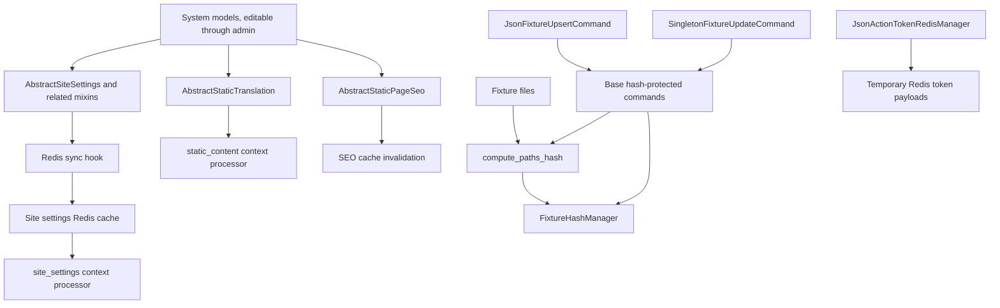

<!-- DOC_TYPE: CONCEPT -->

# Модуль System

## Назначение

`codex_django.system` это слой проектного состояния внутри библиотеки.
Если `core` дает общие Django-примитивы, то `system` дает переиспользуемые модели и workflow для данных, которые принадлежат не одной feature-области, а всему сайту целиком.

Сюда относятся:

- глобальные настройки сайта
- редактируемый статический контент
- credentials для внешних интеграций
- workflow для загрузки фикстур
- utility mixins для типовых проектных сущностей
- базовый scaffold для профиля пользователя

Этот модуль рассчитан на тот самый `system app`, который часто находится в центре сгенерированного проекта.

## Что Находится Внутри

### Конструктор Site Settings

Самая большая часть модуля это конструктор настроек в `system.mixins.settings`.

Вместо одного жестко заданного settings-моделя `system` предлагает набор composable abstract mixins:

- контактные данные
- география и карты
- социальные ссылки
- marketing и analytics идентификаторы
- технические флаги и script injections
- email-инфраструктура

Проект собирает из этих mixins свой конкретный settings model, наследуя `AbstractSiteSettings`.

Ключевая архитектурная идея здесь в том, что настройки сайта рассматриваются как редактируемое проектное состояние, а не как захардкоженные значения в `settings.py`.

### Redis-Синхронизация Проектного Состояния

`AbstractSiteSettings` получает логику синхронизации через `SiteSettingsSyncMixin`.
Когда конкретная settings-модель сохраняется, ее concrete fields превращаются в словарь и синхронизируются в Redis через site settings manager из `core` (используя общий ключ `site_settings`).
Этот же ключ используется модулем `cabinet`, что обеспечивает сквозную синхронизацию расширенных полей модели и настроек брендинга кабинета.

Благодаря этому шаблоны могут быстро получать данные через `system.context_processors.site_settings()`, который возвращает безопасный `SettingsProxy`.

Итоговый runtime path выглядит так:

1. в настройках проекта указывается concrete settings model
2. данные редактируются в admin
3. save hooks синхронизируют значения в Redis
4. шаблоны читают `site_settings` из кэшированного состояния

### Static Content И Легковесный CMS-Паттерн

`system.mixins.translations.AbstractStaticTranslation` дает простой key-value model для редактируемых текстовых фрагментов.
Context processor `static_content()` отдает эти значения в шаблоны как словарь, индексированный по ключу.

Это не полноценная CMS.
Скорее это легкий content-management паттерн для проектов, которым нужны редактируемые статические фрагменты без внедрения большой контентной системы.

### Credentials Для Интеграций

В `system.mixins.integrations` лежат переиспользуемые mixins для внешних сервисов:

- Google services
- Meta / Facebook
- Stripe
- CRM systems
- Twilio
- Seven.io
- произвольные JSON-based integrations

Главная идея в том, чтобы хранить интеграционную конфигурацию рядом с project state models, в первую очередь рядом с site settings, а не разбрасывать секреты и идентификаторы по случайным приложениям.

Часть чувствительных полей использует encrypted model fields, что подчеркивает: `system` хранит не только публичные метаданные, но и операционную конфигурацию проекта.

### Владение SEO-Состоянием

`system.mixins.seo.AbstractStaticPageSeo` задает модельную форму хранения SEO для статических страниц.
При сохранении запись инвалидирует соответствующий SEO-кэш в Redis.

Это дополняет `core`, где лежат selector и cache manager.
Иными словами:

- `core` задает путь доступа к SEO
- `system` задает стандартную модель хранения SEO-данных

### Workflow Для Фикстур

`system.management.base_commands` и `system.redis.managers.fixtures` задают переиспользуемый паттерн для идемпотентной загрузки фикстур.

У этой архитектуры две основные цели:

- не перезагружать неизменившиеся фикстуры
- позволить агрегирующим командам запускать несколько import-шагов как один workflow

Hash-protected command считает объединенный hash файлов фикстур и хранит его в Redis.
Если данные не изменились, импорт пропускается.
Это делает административные update-команды безопаснее и дешевле при регулярном обслуживании проекта.

Поверх этой базы `JsonFixtureUpsertCommand` закрывает типовой проектный паттерн: Django-style JSON fixture импортируется в модель через `update_or_create`.
Проект задает путь к фикстуре, модель, hash key и lookup field; библиотека отвечает за loading, validation, counters и обновление hash.

`SingletonFixtureUpdateCommand` закрывает singleton-состояние сайта, например `SiteSettings`.
Команда читает первую строку фикстуры, обновляет только изменившиеся поля, сохраняет модель только при необходимости и синхронизирует instance через Redis manager site settings.

Агрегирующие команды по-прежнему используют `BaseUpdateAllContentCommand`.
В base command добавлены optional section hooks, чтобы проекты могли сохранять читаемый вывод без override всего execution loop и без потери forwarding `--force`.

### Action Token State

`system.redis.managers.JsonActionTokenRedisManager` дает generic Redis-хранилище временных tokens для confirmation-like flows.
Он создает URL-safe tokens, кладет JSON payload с TTL, безопасно декодирует payload и удаляет использованный token.

Manager намеренно не знает форму payload.
Проекты должны оставлять у себя appointment IDs, action names, proposed slots и URL construction, переиспользуя только библиотечную Redis-механику.

### Базовый Профиль Пользователя

`system.mixins.user_profile.AbstractUserProfile` это переиспользуемая abstract model для профиля, связанного с `AUTH_USER_MODEL`.
Она включает персональные данные, источник появления профиля, заметки и helper-методы вроде полного имени и инициалов.

Это scaffold-level абстракция: проект должен наследовать и адаптировать ее, а не использовать как окончательную доменную модель без изменений.

## Внутренняя Архитектура

## Роль В Репозитории

`system` это слой административного состояния в `codex-django`.
Именно здесь проект хранит и обслуживает данные, которые определяют поведение сайта во время работы:

- какие статические текстовые фрагменты доступны
- какие contact данные показываются пользователю
- какие integration keys настроены
- какие фикстуры уже были импортированы

За счет этого в репозитории появляется четкое разделение ролей:

- `core` отвечает за общую техническую инфраструктуру
- `system` отвечает за переиспользуемые project-state models и административные workflow
- feature-пакеты отвечают за предметное поведение

## См. Также

- `core` для нижележащей Redis-, SEO-, i18n- и template-инфраструктуры, на которой строится `system`
- `notifications` для delivery workflow, которые могут зависеть от system-level credentials и settings
- `cabinet` для UI-ориентированного административного и пользовательского dashboard-слоя
