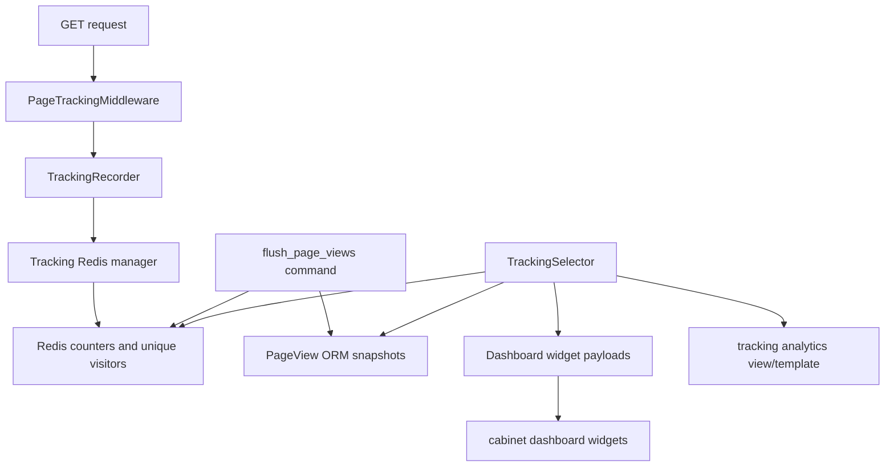

<!-- DOC_TYPE: CONCEPT -->

# Tracking Module

## Назначение

`codex_django.tracking` — это переиспользуемый runtime-модуль page analytics для cabinet-ориентированных Codex-проектов.
Он записывает подходящие HTTP-запросы, хранит краткоживущие счетчики в Redis, отдает сброшенные снимки через Django-модели и превращает эти данные в dashboard widgets и analytics-страницы кабинета.

Модуль нужен затем, чтобы проектам не приходилось заново собирать один и тот же стек из middleware, агрегации и cabinet-интеграции для простой внутренней аналитики посещений.

## Основные части

### Запись запросов

`tracking.middleware.PageTrackingMiddleware` записывает подходящие `GET`-ответы после завершения основного request flow.
Middleware сделан намеренно безопасным:

- не ломает response path
- умеет игнорировать анонимный трафик
- может учитывать редиректы
- пропускает настроенные префиксы URL вроде static/debug путей

Преобразование request в инкремент счетчика живет в `TrackingRecorder`, который нормализует путь, определяет день и передает запись tracking manager-у.

### Runtime-настройки

`tracking.settings.get_tracking_settings()` нормализует и `CODEX_TRACKING`, и legacy-словарь `CABINET_TRACKING` в один immutable-объект `TrackingSettings`.

Через этот слой настраиваются:

- включение tracking runtime
- использование Redis
- Redis URL и key prefix
- TTL для Redis-снимков
- политика анонимного трафика
- учет редиректов
- пропускаемые URL-префиксы
- cabinet URL аналитики и окно аналитики по умолчанию

Так проект держит policy у себя, а библиотека — общую механику.

### Разделение Redis и базы данных

Tracking runtime специально разделен на два слоя:

- Redis хранит краткоживущие счетчики и множества уникальных посетителей для дешевых инкрементальных записей
- `tracking.models.PageView` хранит сброшенные дневные снимки для более стабильной отчетности

`tracking.flush.flush_page_views()` и management command `flush_page_views` связывают эти два слоя.
Это дает быстрый write path для живого трафика и одновременно ORM-backed данные для отчетов.

### Analytics Selector

`tracking.selector.TrackingSelector` — read-only слой агрегации.
Он объединяет ORM-снимки и Redis-счетчики и возвращает готовые payload-ы для dashboard widgets, например:

- total views
- unique visitors
- tracked page counts
- multi-day chart data
- top pages
- recent page-view tables

Selector возвращает typed widget contracts, поэтому шаблоны кабинета остаются тонкими и декларативными.

### Интеграция с cabinet

Tracking app сам регистрирует cabinet-вклад через `tracking.cabinet` и `tracking.providers`.
На старте приложения он добавляет:

- Analytics entry в topbar
- staff-side пункт sidebar
- dashboard widgets через `DashboardSelector.extend(...)`
- отдельную analytics-страницу по настроенному cabinet URL

Из-за этого модуль ощущается как нативная часть cabinet surface, а не как внешний utility.

## Поток выполнения

## Роль в репозитории

`tracking` — это отдельный runtime feature module, а не просто внутренний helper.
Он стоит между инфраструктурой и cabinet UI:

- использует общие Redis- и cabinet-примитивы остального runtime
- отдает готовую analytics-функциональность для generated и hand-built Django-проектов

Поэтому по роли он ближе к `booking` и `notifications`: это переиспользуемый доменный runtime со своими моделями, настройками, selectors и cabinet entrypoint-ами.

## См. также

- `cabinet` — dashboard widgets, topbar entries и композиция analytics-страниц
- `core` — инфраструктурные Redis-паттерны, которые переиспользует tracking
- `system` — более широкий слой project state, рядом с которым часто живут tracking-настройки
